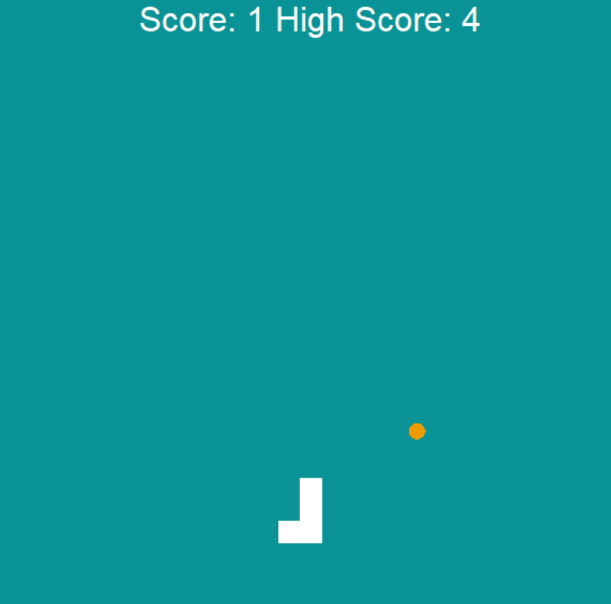
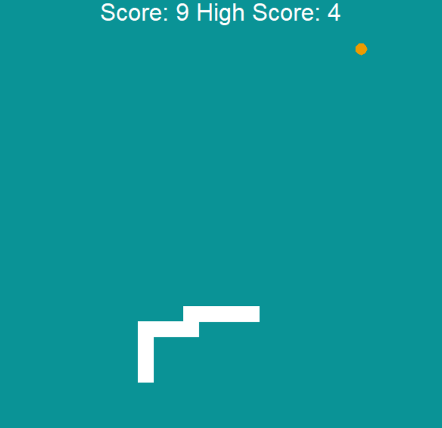

# Snake
Simple Snake game in Python. Move the snake with the arrow keys and eat the food.
Every time you eat the food, the snake will grow. The game ends when you hit the wall or yourself.

Created as a part of Udemys 100 days of code course by Angela Yu.
